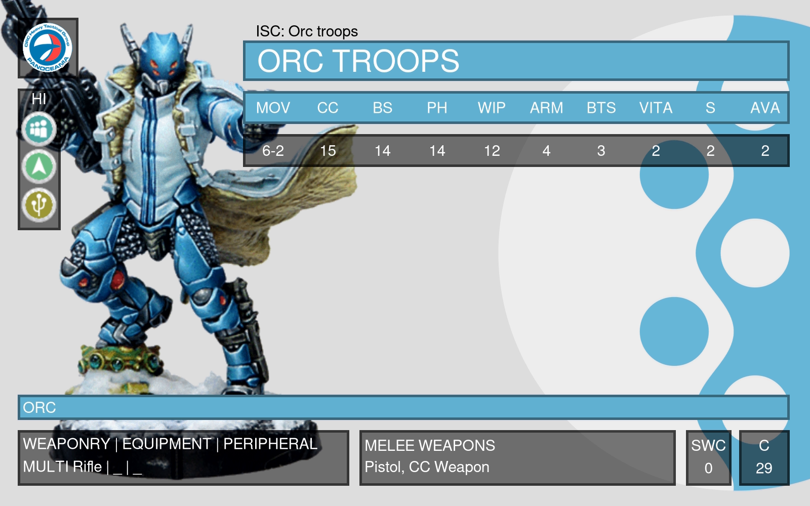
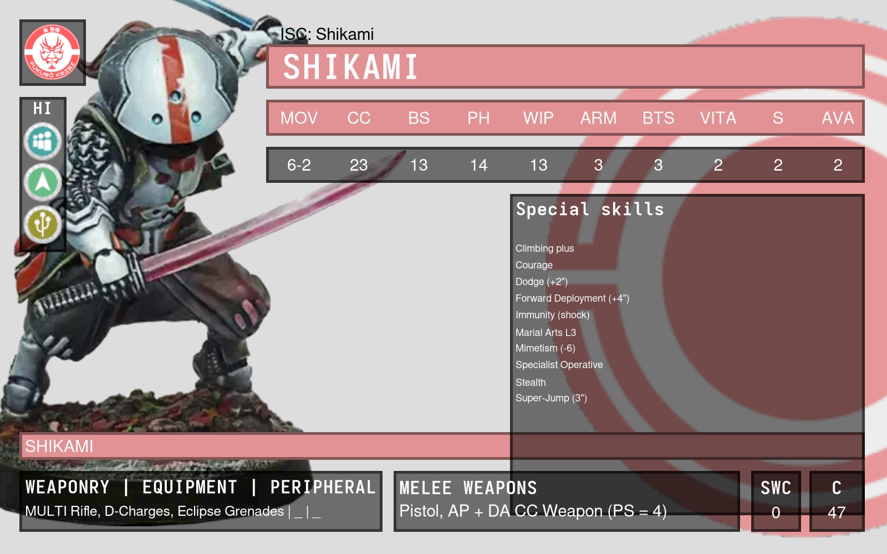

## Troop cards

| Inspiration                                           | Mine                           |
|-------------------------------------------------------|--------------------------------|
|  |  |
|  |     |
|  |                                |

> Sources:
> - [_New Infinity N5 Fireteam Rules; All You Need To Know! | Infinity N5 Week_ from _OnTableTop_][video-1]
> - [Getting started with Infinity N5 – The Infinity Institute][video-2]
>
> Screenshots of cards from these videos have been scaled to ratio 1.6, e.g. 1600x1000.

## Build cards
```nushell
use make.nu
```
```nushell
make (open troops/panoceania/orc.nuon) --color "0x66b6d7" --output assets/panoceania-orc.png
```

[video-1]: https://youtu.be/DhcczP8GJhE
[video-2]: https://youtu.be/fX7fCxJVDd4
