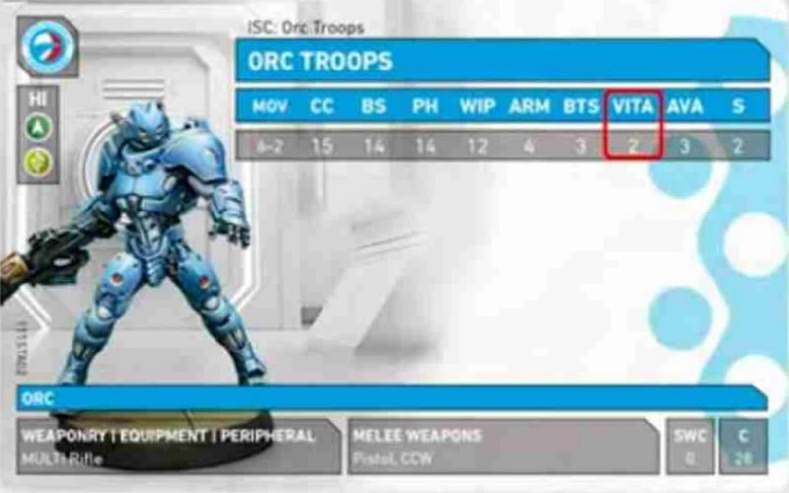
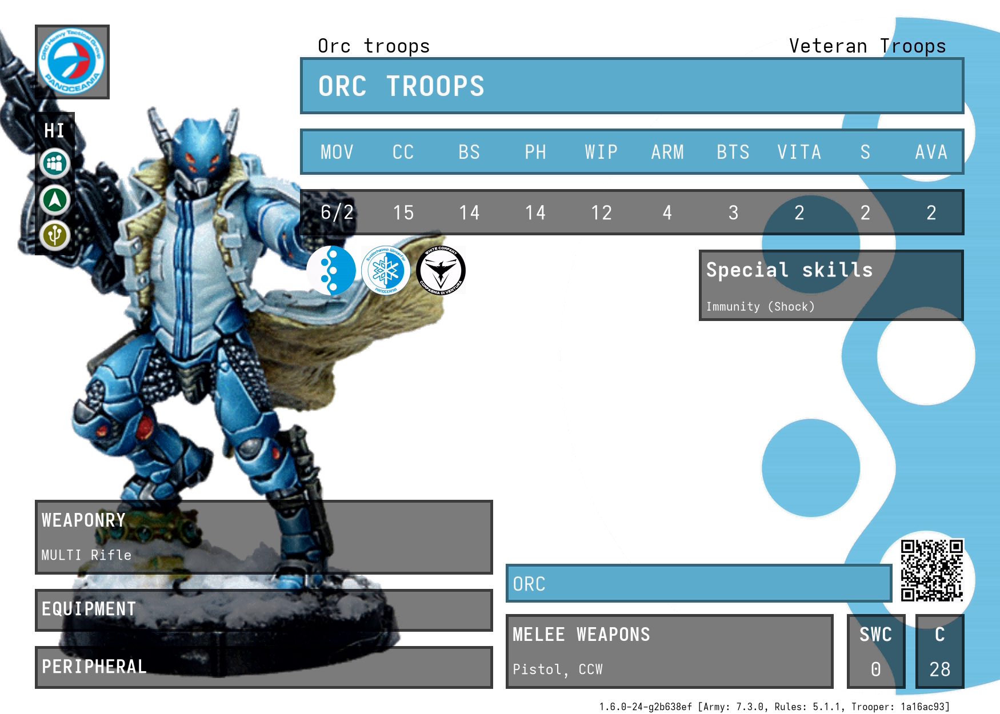
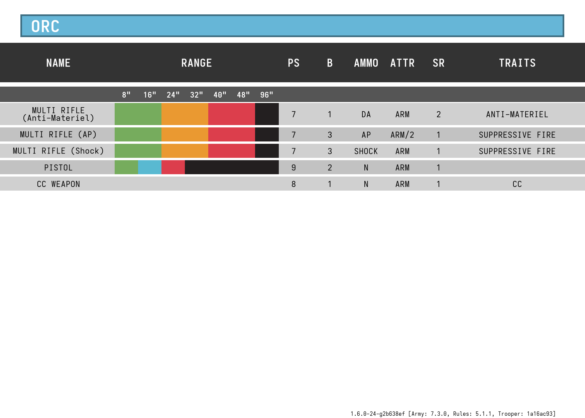
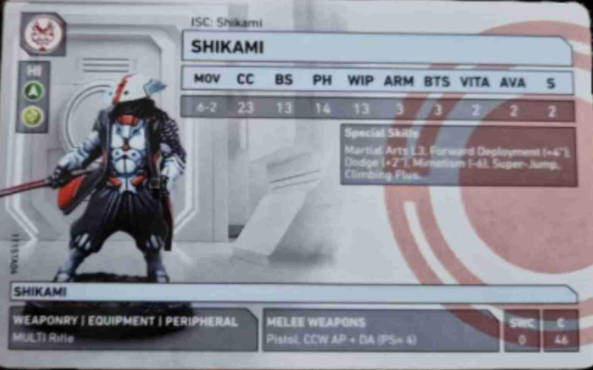
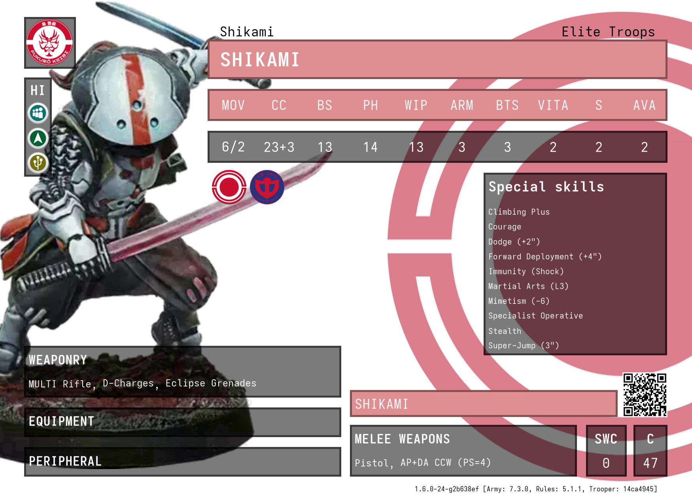
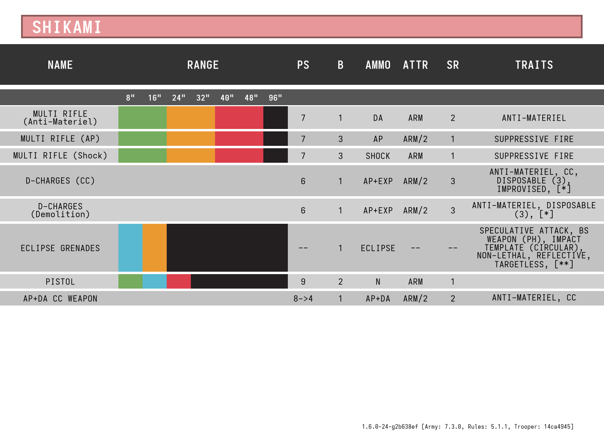
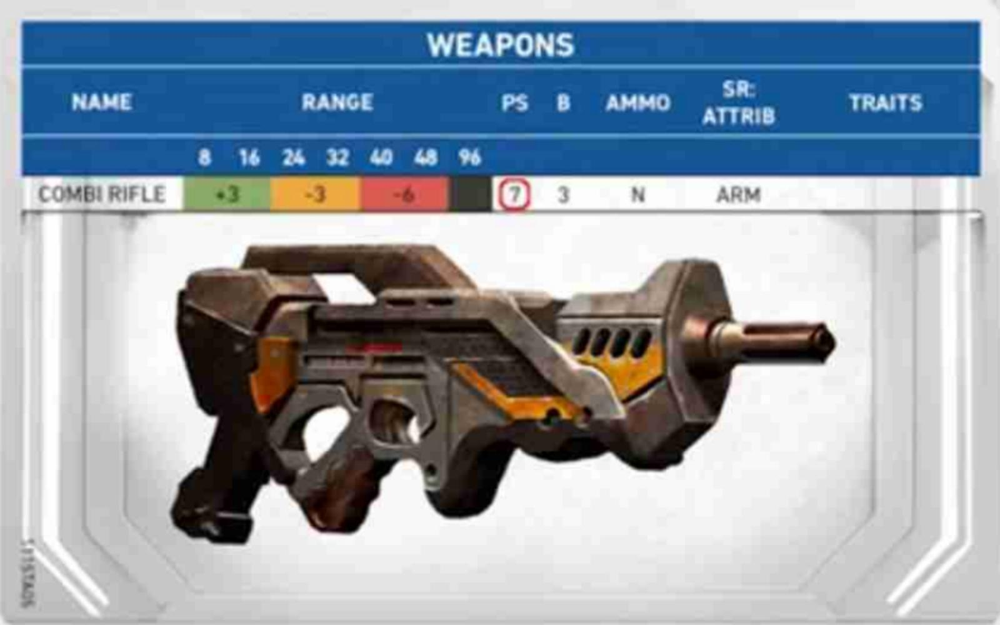

## Troop cards

| Inspiration                                           | Mine (stat page)                   | Mine (charts page)                 |
|-------------------------------------------------------|------------------------------------|------------------------------------|
|  |  |  |
|  |     |     |
|  |                                    |                                    |

> Sources:
> - [_New Infinity N5 Fireteam Rules; All You Need To Know! | Infinity N5 Week_ from _OnTableTop_][video-1]
> - [Getting started with Infinity N5 – The Infinity Institute][video-2]
>
> Screenshots of cards from these videos have been scaled to ratio 1.6, e.g. 1600x1000.

## Build cards
```nushell
nu make.nu
```

## Compare images
```nushell
use src/ffmpeg.nu [ "ffmpeg combine", HSTACKING ]
use src/log.nu [ "log info", "log warning" ]

def compare [a: string, b: string]: [ nothing -> list<path> ] {
    let xs = nu make.nu inspect
        | from json
        | where $it.hash == $b and not $it.dirty
        | get filename
        | path parse
        | get stem

    $xs | each { |x|
        let o = $"img-diffs/($a)-($b)-($x).png"
        let a = $"out/($a)-($x).png"
        let b = $"out/($b)-($x).png"

        if not ($a | path exists) {
            log warning $"($a) not found"
        } else if not ($b | path exists) {
            log warning $"($b) not found"
        } else {
            log info $x
            python img-diff.py $a $b -o $o | ignore
            [$b, $o] | reduce --fold $a { |it, acc|
                [$acc, $it] | ffmpeg combine $HSTACKING --output @rand
            }
        }
    }
}
```
```nushell
compare "a9f44c1f234361d41e275f03ce74934413f13b97" "ee1a163a512f0100e0ddcac76a2901da7ec9bd4a"
```

## Credits
- statistics have been taken from the official [Infinity ARMY online tool][army]
- assets have been taken from the official [Infinity ARMY online tool][army]
- assets of miniatures have been taken from the official [Infinity online store][store]

[video-1]: https://youtu.be/DhcczP8GJhE
[video-2]: https://youtu.be/fX7fCxJVDd4
[army]: https://infinityuniverse.com/army/infinity
[store]: https://store.corvusbelli.com/en/infinity/wargame
