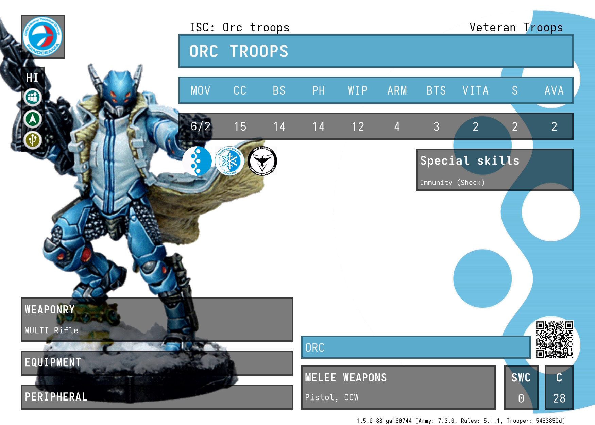
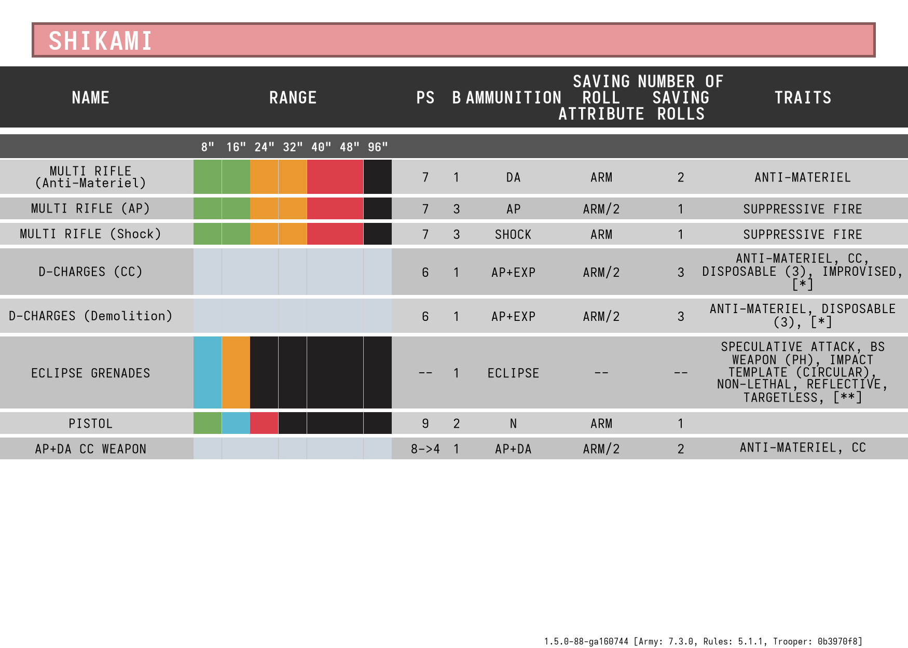

## Troop cards

| Inspiration                                           | Mine (stat page)                 | Mine (charts page)               |
|-------------------------------------------------------|----------------------------------|----------------------------------|
|  |  |  |
|  |   |   |
|  |                                  |                                  |

> Sources:
> - [_New Infinity N5 Fireteam Rules; All You Need To Know! | Infinity N5 Week_ from _OnTableTop_][video-1]
> - [Getting started with Infinity N5 – The Infinity Institute][video-2]
>
> Screenshots of cards from these videos have been scaled to ratio 1.6, e.g. 1600x1000.

## Build cards
```nushell
nu make.nu
```

## Credits
- statistics have been taken from the official [Infinity ARMY online tool][army]
- assets have been taken from the official [Infinity ARMY online tool][army]
- assets of miniatures have been taken from the official [Infinity online store][store]

[video-1]: https://youtu.be/DhcczP8GJhE
[video-2]: https://youtu.be/fX7fCxJVDd4
[army]: https://infinityuniverse.com/army/infinity
[store]: https://store.corvusbelli.com/en/infinity/wargame
